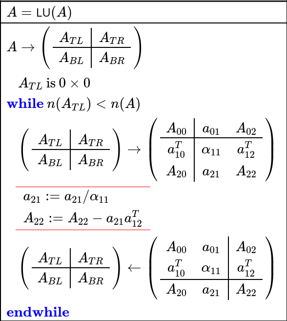
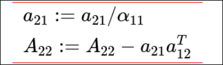
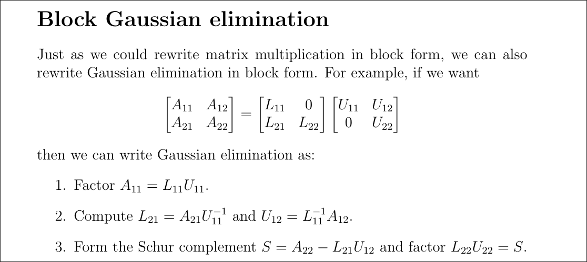

Introduction:
My final project proposition proposed to implement memory capacity, a task agnostic performance metric used in my thesis, in CUDA. This proved to be challenging due to the constraints and challenge of writing code in CUDA. I managed to implement a large portion of this measure, though the array slicing and summing over all delays was not included. I invested my time into deeply investigating and developing low level implementations of the underlying matrix functions. This deviation translated this project from a simple CUDA port to an investigation into the backbone methods supporting matrix solving on GPUs.   

First I developed:
- Ridge Regression in CUDA
	- both using CUDA solverDX and the normal CUDA solver package
	- parallelized Pearson correlation coefficient loss
This was in order to compute memory capacity. Through developing this code I learned about, kernel overhead, parallelism, matrix solving on GPUs, and NVIDIAs matrix libraries.

Then to give a comparison I developed 
- Ridge Regression in python using tensors and using np arrays
This was used to compare against the running time of the CUDA implementation
- data_anal.py for analyzing the cuda data
- data.txt - data from cuda
used to compare accross blksize/thread counts/python implementation

To investigate how parallelized matrix solves worked I wrote:
- Blocked Lu decomposition in python (stretch goal)
	- (only for block size 2)
	- this is close to what the cuda algorithms use for processing large non symmetrical positive definite arrays
This taught me about how matrices were factored before solving on GPUs

#### Ridge Regression in CUDA
___
##### Helpers
- print_arr
	- prints an array on host thats in column major order
- print_vec
	- prints a vector on host
- print_cuda
	- prints a matrix on device
- print_cuda_vec
	- prints a vector on device
- vec_cuda_to_dev
	- moves a vector from device to host
- vec_dev_to_cuda
	- moves a vector from host to device
- set_arr
	- takes an array in row major and converts it to column
- set_vector
	- sets a vector
- set_vector_val
	- sets all values of a vector to a single value
- get_vector
	- makes an array and sets the values in it to that of a vector
- matrix_host_to_cuda
	- moves a matrix from the host to the device
- rand_arr
	- generates a float array with randomly set ints between 1 and 100 of size m x n
- rand vector
	- generates a float vector with randomly set ints between 1 and 100 of size n
##### CUBLAS/CUSOLVER code
- XTY
	- computes $X^T Y$
		- works for both square and rectangle matrices
- XY
	- computes $X Y$
		- works for both square and rectangle matrices
- XPY
	- computes $X+Y$
- XINV
	- Computes($X^{-1}$)
	- Solves using PIVOT
		- this helps when theres 0s on the diagonal,
	- Its not needed but was included for numerical stability
- Ridge Reg
	- Computes
		- $X^{T}X$
		- $X^{T}X + \alpha ID$
		- $(X^{T}X + \alpha ID)^{-1}$
		- $X^T Y$
		- $(X^{T}X + \alpha ID)^{-1}X^T Y$
	- You can solve either using CUDAsolver or CUDASOLVERDX

##### CUDASOLVERDX
- INV_DX
	- Computes($X^{-1}$)
	- Uses Cholsky solver (POSV)
	- Matrix must be hermitian positive definite for cholsky solver
	- It can solve matrices extreme quickly but can only do matrices up to 6x6 due to shared memory constraints
	- It uses the BLK_SIZE, and THR_PER_BLK as defined at the top of the file
	- Depending on the BLK_SIZE and THR_PER_BLK, it can fail leading to a matrix of Nans
		- I dont understand why this happens, it only happens rarely
		- I wondered if it was imprecision in floating point addition leading to non symmetrical matrices or problems with shared memory but it was not
		- I spent many hours debugging this and could not find any help online or in my testing, if I had unlimited time I would work on this

##### Self-implemented Kernels
- Reduce6
	- adjusted from https://developer.download.nvidia.com/assets/cuda/files/reduction.pdf
	- this does a very fast reduce of an input vector
- sub_val
	- subtracts a constant from all values in a matrix
- sub_val_sq
	- subtracts a constant from all values in a matrix
	- then element wise squares the matrix
- elementwise
	- element wise multiplication between two vectors
- mult
	- helper for element wise
- sum
	- helper for reduce6
- dif
	- helper for sub_val
	- helper for sub_val_sq

r2_score (this is pearson correlation squared)
- before calculating we subtract the mean of y from y and the mean of y_hat from y_hat
- Get_Top
	- helper for the numerator of pearson correlation squared
	- computes sum(mult(y,$\hat{y}$))
- Get_bot
	- helper for the denominator of pearson correlation squared
	- computes sqrt(sum($y^2$) $*$ sum$(\hat{y}^2$))
- Then it divides top by bottom and squares that value to get the pearson correlation coefficient squared.

This file computes
$W = (X^{T}X + \alpha ID)^{-1}X^T y$
$\hat{y} = X W$
Pearson$^2$ = ($\hat{y},y$) 
___
#### Ridge Regression in python using Numpy arrays for comparison
- ridge_fit_predict
	- does $(X^{T}X + \alpha ID)^{-1}X^T y$ on tensors
- corr2_score
	- Pearson$^2$ = ($\hat{y},y$) 
- random_vec
	- random vector of size n numbers between 1,100
- random_arr
	- random array of size n x m numbers between 1,100

___
#### Comparison between CUDA and PYTHON tensor code
(using data_anal.py)

First attempt

| THR    | BLK    | mean time          | std                |
| ------ | ------ | ------------------ | ------------------ |
| 32     | 256    | 258.5719042        | 26.340566639320528 |
| 32     | 128    | 257.54859379999994 | 28.499192798172817 |
| 32     | 64     | 257.08336          | 26.478436393968554 |
| 64     | 256    | 256.02963845000005 | 25.9184727183783   |
| 64     | 128    | 257.7797734        | 27.582253538102112 |
| 64     | 64     | 257.1669129        | 28.712430752237122 |
| 128    | 256    | 257.3079565        | 25.643932827247237 |
| 128    | 128    | 257.05901439999997 | 26.544046968394277 |
| 128    | 64     | 257.64196000000004 | 27.381363089126335 |

Python

| PY     | PY     | 804.83505475      | 41.90017200784613  |
| ------ | ------ | ----------------- | ------------------ |
| PY_SEQ | PY_SEQ | 767.53663325      | 1.4775274987909315 |

Final attempt (using some suggestions from my Dad)

| 32  | 64  | 75.04664619999998 | 12.84358913533388  |
| --- | --- | ----------------- | ------------------ |
| 32  | 128 | 76.14163955000001 | 13.135908966757937 |
| 32  | 256 | 73.75729270000001 | 11.553181065945507 |
| 64  | 64  | 73.44701895       | 12.37165245293613  |
| 64  | 128 | 74.21593349999999 | 12.143094028223295 |
| 64  | 256 | 72.31791727272729 | 11.454574927977756 |
| 128 | 256 | 73.44250620000001 | 11.5268309216539   |
| 128 | 128 | 72.9670928        | 11.808282676410803 |

The benchmark I ran consists of 100 random 6x6 float solves with time averaged over 20 trials.
- The distribution of random numbers matters a lot
- If the numbers are not mean zero, they can grow or shrink to large magnitudes. Even if they are mean zero they can still shrink or grow to large magnitudes depending on the magnitude of the distribution
- It is most stable with values being +1-1, for our testing we initially did sampled from [1,100] which lead to occasional errors due to imprecision in large float values (~2/100 runs). We switched it to $\pm100$ which leads to errors in about (~1/400 runs). Google’s built-in AI summary helped me identify the numerical floating point issue with [1,100], but it did not write or modify the code.

There are three interesting results to observe from the benchmark run.
1. regardless of the THR_PER_BLK and BLK_SIZE, mean time stays remarkably consistent
	1. This suggests that the majority of run time is dominated by kernel launch / memory copying overhead, as its clear that allocating more computational resources does not impact the average speed of 100 solves
2. The parallelized torch based Python script runs ~$3x$ slower than the non-optimized CUDA script and ~10x slower than the optimized CUDA script
	1. This is due to overhead from calling kernels in python
	2. Overhead from autograd, and dispatching
		1. source: https://discuss.pytorch.org/t/example-where-pytorch-substantially-slower-than-c-cuda/179076/5
3. The Final attempts used streams to do the matrix operations in ridge regression in parallel rather than doing them sequentially.
	1. Originally, I had done these operations in parallel using CPP's standard concurrency library. This lead to shared memory being overwritten during computations; thus I switched them to sequential and finally switched them to use streams.
	2. Finally, in this version I stopped recreating and destroying the handles in the functions (such as XY, XTY, XPY) rather I create the handles in main then pass them to CUBLAS and CUSOLVER
	3. This lead to a ~3.5x speedup over the original CUDA script and a ~10x speedup over the python script
4. The sequential single threaded numpy based Python script runs ~$3x$ slower than the non-optimized CUDA script and ~10x slower than the optimized CUDA script, but is actually running at the same speed as the torch based Python script
	1. This suggests that for problems of this size the overhead of kernel launches and memory copies is simply not worth the hassle, unless you are batching the matrix solves.

My final project's main theme is overhead. It is clear that in working with solves on small matrices overhead is often times the largest cost in the computation. For CUDA, the overhead comes in the form of memory copies and kernel launches. For python it inherits these overheads and adds its own in the form of generalization in torch. My CUDA code assumes float values of a particular size. The torch code must handle a variety of datatypes. Its code may also involve more kernel launches or be optimized for larger matrix solves.

Speaking of larger matrices I wanted to investigate how GPU's can be used to solver larger matrices. These experiments elucidated the challenge of using shared memory for large matrix solves so I wanted to further investigate how that was done.

___
#### Deep Dive, stretch goal
Lu_decomp.py

I found that my CUDA methods only worked on up to 6x6 matrices

I wanted to understand how I could work on larger matrices, and how larger matrices are able to be done using global memory.

For this I investigated blocked LU decomposition

LU decomposition is the process to decomposing a matrix A into two parts: a lower triangular matrix L and an upper triangular matrix U.

Once a matrix is in LU form then solving is easy as one only would need to do back substitution.
[source](https://www.cs.utexas.edu/~flame/laff/alaff/chapter05-launch.html)
To do unblocked LU decomposition you do this

To do the blocked update our $a_{11}$ is no longer a scalar but rather a blocksize X blocksize matrix

Thus: dimensions of each of our Matrix parts are as follows

- $A_{00}$ = pivot X pivot
- $a_{01}$ = pivot x blocksize
- $A_{02}$ = n-(pivot+blocksize) x pivot
- $a_{10}^T$ = blocksize x pivot 
- $\alpha_{11}$ = blocksize x blocksize
- $a_{12}^T$ = blocksize x n-(pivot+blocksize)
- $A_{20}$ = pivot x n-(pivot+blocksize)
- $a_{21}$ = n-(pivot+blocksize) X blocksize
- $A_{22}$ =  n-(pivot+blocksize) x  n-(pivot+blocksize)

Thus we have a function that breaks up the matrix A into its parts 
${A_{00}}\space{a_{01}}\space{A_{02}}\space{a_{10}^T}\space{\alpha_{11}}\space{a_{12}^T}\space{A_{20}}\space{a_{21}}\space{A_{22}}$

Furthermore we must do a more complicated update because $a_{11}$ is no longer a scalar in the blocked version.

Here is an example for how the matrix is broken up for 
n=6
blocksize =2
pivot = 2

| $A_{00}$   | $A_{00}$   | $A_{01}$     | $A_{01}$     | $A_{02}$   | $A_{02}$   |
| ---------- | ---------- | ------------ | ------------ | ---------- | ---------- |
| $A_{00}$   | $A_{00}$   | $A_{01}$     | $A_{01}$     | $A_{02}$   | $A_{02}$   |
| $A_{10}^T$ | $A_{10}^T$ | **$A_{11}$** | **$A_{11}$** | $A_{12}^T$ | $A_{12}^T$ |
| $A_{10}^T$ | $A_{10}^T$ | **$A_{11}$** | **$A_{11}$** | $A_{12}^T$ | $A_{12}^T$ |
| $A_{20}$   | $A_{20}$   | $A_{21}$     | $A_{21}$     | $A_{22}$   | $A_{22}$   |
| $A_{20}$   | $A_{20}$   | $A_{21}$     | $A_{21}$     | $A_{22}$   | $A_{22}$   |

Thus we use the Schur complement to update $A_{22}$

We follow these steps seen [here](https://www.cs.cornell.edu/~bindel/class/cs6210-f12/notes/lec09.pdf)

First we solve and update $A_{11}$ by doing a simple 2x2 solve (seen in solve_block_2x2)
This gives us both $L_{11},U_{11}$

Then we compute $L_{21},U_{12}$ using the functions solve_l and solve_u, these are simple back substitution solves. In the code itself I denoted what could be parallelized and what must be done sequentially.

---
These are implemented as follows To solve for $L_{21}$

We want L such that where $B_n$ is a row of A_21, note this is guaranteed to have two columns. Each of these solves can be done in parallel
$$\forall \text{rows in $A_{21}$, enumerated by n} \quad \begin{vmatrix}X_{n0} & X_{n1}\\\vdots &\vdots 
\end{vmatrix} U_{11} = \begin{vmatrix}B_{n0} & B_{n1}
\\\vdots &\vdots \end{vmatrix}$$

This solve is easy because $U_{11}$ is a 2x2 matrix that is upper triangular, thus

$B_{n0} = X_{n0} * U_{00}$ 
$B_{n1} = X_{n0} * U_{01} + X_{n1}*U_{11}$ 
solving for X
$X_{n0} = \frac{B_{n0}}{U_{00}}$ 
$X_{n1} = \frac{B_{n1}-(X_{n0}*U_{01})}{U_{11}}$
These can be done in parallel but it might be less costly to do them sequentially. To do them in parallel $X_{n0}$ would just be recomputed when computing $X_{n1}$. It depends on the speed of computation vs the speed of memory transfers.

---
These are implemented as follows To solve for $U_{12}$

We want U such that where $B_n$ is a row of A_12_t, note this is guaranteed to have two rows. Thus $U_{12}$ must also have two rows. Each of these solves can be done in parallel
$$\forall \text{rows in $A_{21}$, enumerated by n} \quad  L_{11} \begin{vmatrix}X_{0n} &\dots \\ X_{1n}&\dots
\end{vmatrix} = \begin{vmatrix}B_{0n}&\dots \\ B_{1n}&\dots
\end{vmatrix}$$

This solve is easy because $L_{11}$ is a 2x2 matrix that is lower, thus

$B_{0n} = X_{0n}$ 
$B_{1n} = X_{0n} * L_{10} + X_{1n}$ 
solving for X
$X_{0n} = B_{0n}$ 
$X_{1n} = B_{1n}-(L_{10} * B_{0n})$

These can be done in parallel.
___
Once these are computed we do a matrix multiplication and subtract from $A_{22}$ 

We update the matrix with

$$A_{11} = solved(A_{11})$$
$$A_{22} = A_{22}- L_{21}U_{12}$$
$$A_{21} = L_{21}$$
$$A_{12} = U_{12}$$
We repeat until the blocks reach the end at which point we have a factored matrix.
Here are the steps that are repeated
- breakup the matrix
- get updated $A_{11}$ and $L_{21}U_{12}$
- update $A_{22}$
- update matrix
Once this has finished we break the matrix apart into the L and U parts, observe that $LU$ is equal to the original matrix $A$

#### Commentary on LU decomp
___
This code has lots of opportunities for parallelism and I have commented in the code all of the ways I could think of to parallelize the code. I have commented where operations should be done in parallel in order to improve wall clock time performance.

I should note that this code allows one to solve matrices while not loading the whole matrix into shared memory. The amount of shared memory used by this program scales super linearly with blocksize. And (except for $A_{22}$, also depends on how matrix multiplication is implemented) linearly with matrix size. The only parts of the matrix needed in shared memory are $A_{11},A_{22},A_{21},A_{12}$ and $L_{21},U_{12}$. The size of these matrices is mainly controlled by the block size. Furthermore, if the matrix is so big that one or all of these cannot fit into shared memory each of the steps can be batched so that only a smaller portion of the matrix is in shared memory. 

___
#### Conclusion:

My final project changed forms many times throughout the process of completing it. I underestimated the challenge of implementing "simple" matrix operations in a parallelized fashion in CUDA. I now understand how LU decomposition and by proxy parallelized matrix solves work. I also understand the challenge and also reward of implementing existing methods in CUDA.  

#### Future Directions/Limitations:

A limitation in this project was the lack of slicing used in memory capacity.

MC is defined by Jaeger as 

$$\sum_{D=0}^{\inf}=MC_D$$
My code computes
$MC_{D=0}$ which is not the full memory capacity. I would need to slice the array and sum over all delays to accomplish this. I would like to implement this in the future

Finally, I would like to have implemented my LU factorization on CUDA but this seems quite daunting. My implementation in Python does not make use of the potential parallelization that could be gained. I would also like to re-implement this code to work for multiple block sizes not just blocksize 2. 